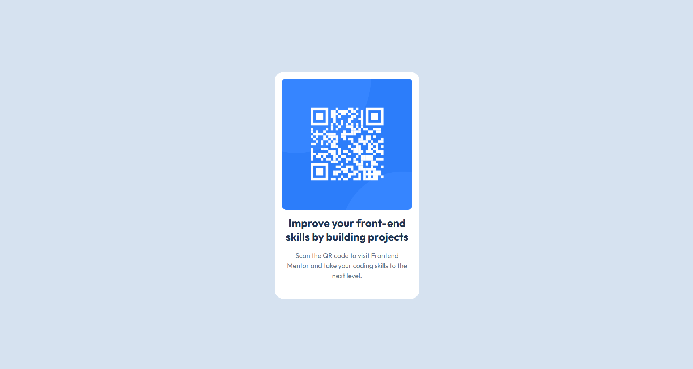

# Frontend Mentor - QR code component solution

This is my solution to the QR Code Component challenge on Frontend Mentor. The goal of this project was to build a responsive QR code card that matches the provided design as closely as possible using semantic HTML and modern CSS.

## Table of contents

- [Overview](#overview)
  - [Screenshot](#screenshot)
  - [Links](#links)
- [My process](#my-process)
  - [Built with](#built-with)
  - [What I learned](#what-i-learned)
  - [Continued development](#continued-development)
  - [AI Collaboration](#ai-collaboration)
- [Author](#author)

## Overview

### Screenshot

### Links

- Solution URL: https://github.com/Developer-Aisurya/qr-code-component
- Live Site URL: https://your-live-site-url.com

## My process

### Built with

- Semantic HTML5
- CSS3
- CSS Custom Properties
- Flexbox
- Mobile-first workflow

### What I learned

While building this project, I strengthened my understanding of:

- Writing semantic HTML structure.
- Creating responsive layouts using Flexbox.
- Using CSS custom properties for cleaner and more maintainable code.
- Matching a design as closely as possible by paying attention to spacing, typography, and colors.

### Continued development

In future projects, I want to continue improving my responsive design skills, write cleaner CSS, and build more complex layouts with better accessibility and maintainability.

### AI Collaboration

I wrote the entire project myself. I used ChatGPT only as a learning companion to clarify concepts, answer questions, and review my work when I was unsure about certain implementations. The final code and implementation were written by me.

## Author

- GitHub - https://github.com/Developer-Aisurya
- Frontend Mentor - https://www.frontendmentor.io/profile/Developer-Aisurya